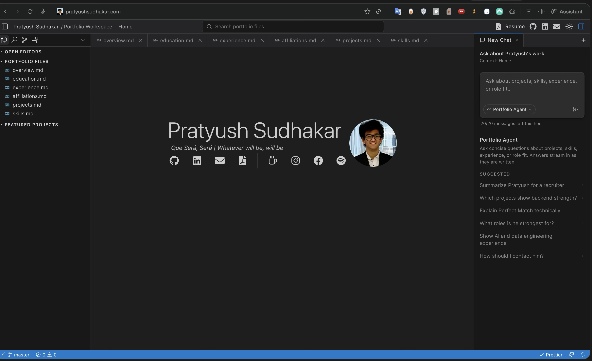
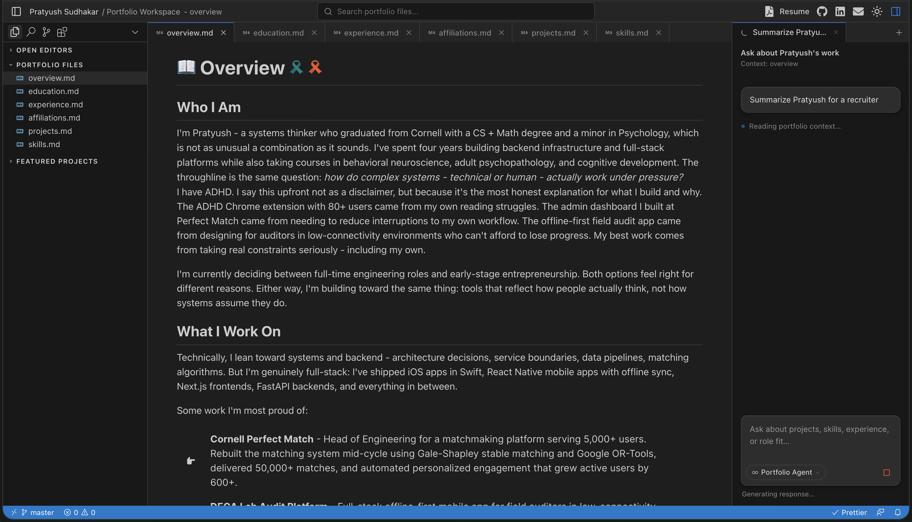
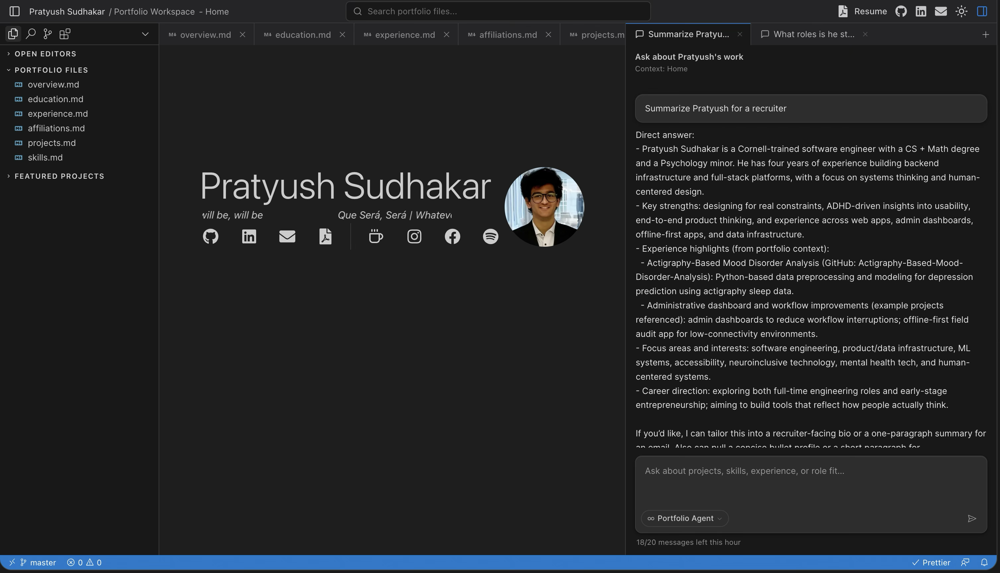

# My Cursor-Themed Personal Website

A Cursor-inspired, AI-native personal workspace built with Next.js 16 (App Router) and Material UI: [Live Demo](https://pratyushsudhakar.com/)

<p align="left">
		<em>Developed with the software and tools below.</em>
</p>
<p align="left">
	
	
	
	
	
	
	<br>
	
	
	
	
	
	
</p>
<hr>

## 🔗 Quick Links

> -   [📍 Overview](#-overview)
> -   [📸 Screenshots](#-screenshots)
> -   [🎉 Features](#-features)
> -   [🚀 Getting Started](#-getting-started)
>     -   [⚙️ Installation](#️-installation)
>     -   [🤖 Running](#-running)
> -   [🤝 Contributing](#-contributing)

---

## 📍 Overview

The source code for my personal website: a Cursor-style IDE workspace where my portfolio content lives as files in an explorer, opens as tabs, and is queryable through an in-app AI agent.

---

## 📸 Screenshots

### Home

Apple Watch-themed landing page inside the Cursor-style workspace.



### Overview

Portfolio content opened as markdown tabs in the editor surface.



### Portfolio Agent

In-app AI agent answering recruiter-style questions with streamed markdown responses.



---

## 🎉 Features

-   **Cursor-style workspace**: Left sidebar, explorer panel, agents panel, and editor surface laid out like the Cursor IDE.
-   **Portfolio AI Agent**: An in-app chat agent that answers questions about my experience, projects, education, and the site itself.
    -   Server-streamed responses via the Vercel AI SDK
    -   Hourly rate limits and prompt guards to keep responses on-topic
    -   Context-aware: experience, projects, GitHub activity, and site-support questions
    -   Markdown rendering (bold, lists, links) in responses
-   **Content files**: Markdown-backed pages — Overview, Experience, Education, Projects, Skills — opened as tabs in the workspace.
-   **Home page**: Apple Watch-themed landing page with bubbles surfacing my Spotify playlist.
-   **Resume**: Downloadable PDF.
-   **Light and dark mode**: Themed across every panel.

---

## 🚀 Getting Started

**_Requirements_**

Ensure you have the following dependencies installed on your system:

-   **TypeScript**
-   **pnpm**

### ⚙️ Installation

1. Clone the repository:

    ```sh
    git clone https://github.com/pratyush1712/Personal-Website/
    ```

2. Change to the project directory:

    ```sh
    cd Personal-Website
    ```

3. Install the dependencies:

    ```sh
    pnpm install
    ```

### 🤖 Running

Use the following command to run :

    pnpm dev

## 🤝 Contributing

Contributions are welcome! Here are several ways you can contribute:

-   **[Submit Pull Requests](https://github.com/pratyush1712/Personal-Website/blob/main/CONTRIBUTING.md)**: Review open PRs, and submit your own PRs.
-   **[Join the Discussions](https://github.com/pratyush1712/Personal-Website/discussions)**: Share your insights, provide feedback, or ask questions.
-   **[Report Issues](https://github.com/pratyush1712/Personal-Website/issues)**: Submit bugs found or log feature requests for .

<details closed>
    <summary>Contributing Guidelines</summary>

1. **Fork the Repository**: Start by forking the project repository to your GitHub account.
2. **Clone Locally**: Clone the forked repository to your local machine using a Git client.
    ```sh
    git clone https://github.com/pratyush1712/Personal-Website/
    ```
3. **Create a New Branch**: Always work on a new branch, giving it a descriptive name.
    ```sh
    git checkout -b new-feature-x
    ```
4. **Make Your Changes**: Develop and test your changes locally.
5. **Commit Your Changes**: Commit with a clear message describing your updates.
    ```sh
    git commit -m 'Implemented new feature x.'
    ```
6. **Push to GitHub**: Push the changes to your forked repository.
    ```sh
    git push origin new-feature-x
    ```
7. **Submit a Pull Request**: Create a PR against the original project repository. Clearly describe the changes and their motivations.

Once your PR is reviewed and approved, it will be merged into the main branch.

</details>

---
