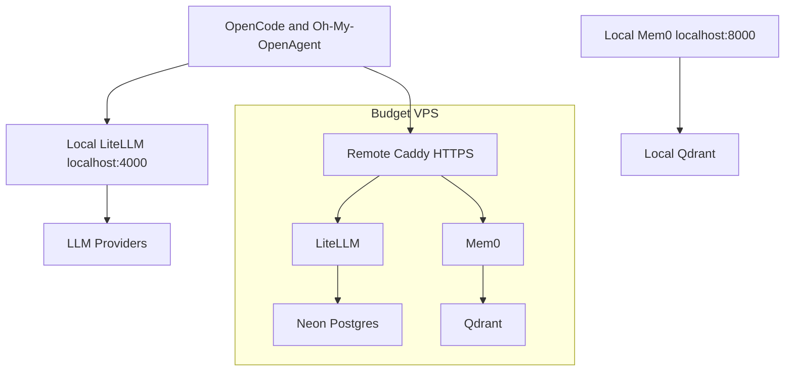

# GitHub Context

## Curated repositories

## pratyush1712/Personal-Website

- Description: My Personal Website crafted with Next.js 14 and Material UI; optimized for SEO via statically generated pages showcasing content in markdown format.
- URL: https://github.com/pratyush1712/Personal-Website
- Homepage/demo: https://pratyushsudhakar.com
- Primary language: TypeScript
- Stars: 2
- Last pushed: 2026-06-02T04:31:26Z

### README excerpt

# My VSCode-Themed Personal Website

Personal Portfolio Built Using Next.js 14 and Material UI: [Live Demo](https://pratyushsudhakar.com/)

<p align="left">
		<em>Developed with the software and tools below.</em>
</p>
<p align="left">
	
	
	
	
	
	
	<br>
	
	
	
	
	
	
</p>
<hr>

## 🔗 Quick Links

> -   [📍 Overview](#-overview)
> -   [� Features](#-features)
> -   [🚀 Getting Started](#-getting-started)
>     -   [⚙️ Installation](#️-installation)
>     -   [🤖 Running ](#-running)
> -   [🤝 Contributing](#-contributing)

---

## 📍 Overview

This repository contains the source code for my personal website. The website is built u
...(README excerpt truncated)

## pratyush1712/pratyush1712

- Description: No public description provided.
- URL: https://github.com/pratyush1712/pratyush1712
- Last pushed: 2024-09-09T01:50:09Z

### README excerpt

# `Hi there!!`
[](mailto:me@pratyushsudhakar.com) 
[](https://www.linkedin.com/in/pratyushsudhakar/)
<a style="text-decoration:none;" href="https://pratyushsudhakar.com" target="_blank">
  
</a>
<a style="text-decoration:none;" href="https://private.pratyushsudhakar.com" target="_blank">
  
</a>

👋 Hello! I'm Pratyush Sudhakar, currently pursuing <ins>computer science</ins> :computer:, <ins>mathematics</ins> :abacus:, and <ins>psychology</ins> 🧠 at Cornell University.

## Programming Languages


## pratyush1712/Personal-Agent-Homebase

- Description: No public description provided.
- URL: https://github.com/pratyush1712/Personal-Agent-Homebase
- Primary language: JavaScript
- Last pushed: 2026-04-27T02:25:10Z

### README excerpt

# Hybrid OpenAgent Stack

Budget-friendly infrastructure for an AI coding workflow built around:

- **OpenCode + Oh-My-OpenAgent** for local agent orchestration.
- **LiteLLM** for OpenAI-compatible model routing, spend tracking, and fallbacks.
- **Mem0** for agent memory.
- **Local PostgreSQL + pgvector** for development persistence.
- **Neon Postgres** for production LiteLLM persistence.
- **Qdrant** for vector search.
- **Caddy** for production HTTPS reverse proxying.

The intended shape is hybrid: run the fast local stack on your Mac during daily development, and keep a small VPS stack online for remote HTTPS access and durable shared state.

## Architecture



## Files

| Path                                 | Purpose                                                 |
| ------------------------------------ | ------------------------------------------------------- |
| `docker-compose.yml`                 | Shared LiteLLM, Mem0, and Qdrant service graph          |
| `docker-compose.local.yml`           | Local PostgreSQL for LiteLLM and loopback port bindings |
| `docker-compose.prod.yml`            | Production Caddy bindings and LiteLLM Neon settings     |
| `mem0/Dockerfile`                    | amd64-safe Mem0 API image build from Python source path |
| `Caddyfile`                          | HTTPS reverse proxy and status endpoint                 |
| `litellm.config.yaml`                | Cost-first model routing and LiteLLM settings           |
| `
...(README excerpt truncated)

## pratyush1712/braindump

- Description: No public description provided.
- URL: https://github.com/pratyush1712/braindump
- Homepage/demo: https://braindump-zeta.vercel.app
- Primary language: TypeScript
- Last pushed: 2025-10-30T21:54:37Z

### README excerpt

# Brain Dump - Intelligent Infinite Canvas

An intelligent brain dump application with an infinite canvas that automatically organizes your thoughts into categories, discovers connections between ideas, and generates actionable roadmaps.

## 🌟 Features

### Core Capabilities
- **Infinite Canvas**: Free-form thought capture on an unlimited canvas
- **Auto-Categorization**: AI-powered automatic categorization of thoughts
- **Connection Discovery**: Intelligent identification of relationships between ideas
- **Roadmap Generation**: Automatic creation of actionable plans from your thoughts
- **Real-time Processing**: Instant background processing using WebSockets
- **Offline Support**: Local storage with IndexedDB for offline capability

### Smart Organization
- **Semantic Analysis**: Uses OpenAI embeddings to find semantically similar thoughts
- **Entity Recognition**: Identifies shared topics, people, and concepts
- **Temporal Connections**: Groups thoughts captured around the same time
- **Visual Relationships**: Interactive graph visualization of idea connections

## 🚀 Getting Started

### Prerequisites
- Node.js 18+ 
- npm or yarn
- OpenAI API key

### Installation

1. **Clone the repository**
```bash
git clone <your-repo-url>
cd network
```

2. **Install dependencies**
```bash
npm install
```

3. **Set up environment variables**
Create a `.env` file in the root directory:
```bash
OPENAI_API_KEY=your_openai_api_key_here
PORT=3001
NODE_ENV=development
```

4. **Start the application**
```bash
npm run dev
```

This will start:
- Frontend: http://localhost:3000
- Backend: http://localhost:3001

## 💡 Usage

### Creating Thoughts
1. **Double-click** anywhere on the canvas to create a new thought
2. Type your thought in the input box
3. Press **Enter** to save (Shift+Enter for new line)
4. Press **Esc** to cancel

### Viewing Connections
- Thoughts are automatically connected based on semantic similarity
- Different connection types are shown with different colors:
  
...(README excerpt truncated)

## pratyush1712/Habits-OS

- Description: No public description provided.
- URL: https://github.com/pratyush1712/Habits-OS
- Homepage/demo: http://habits.pratyushsudhakar.com
- Primary language: Python
- Last pushed: 2026-06-01T23:02:01Z

### README excerpt

# HabitOS

A small, local-first habit dashboard generator that turns tracker data into a
calm, hyperlinked monthly PDF for **reMarkable 2**.

The full pipeline is wired end to end:

> WHOOP + Day One + manual events → normalized `source_events` → habit rule engine → persisted `habit_entries` → rendered monthly PDF → manual or automated reMarkable sync.

A nightly APScheduler job reconciles a rolling window, recomputes touched
months, renders the current month, and (optionally) pushes the PDF to the
reMarkable Cloud via [`ddvk/rmapi`](https://github.com/ddvk/rmapi). The
manual reMarkable adapter remains the default — it never mutates device or
cloud state, only returns upload instructions.

See [AGENTS.md](AGENTS.md) and [CLAUDE.md](CLAUDE.md) for the full plan.

---

## Quickstart

Requirements: Python 3.11+, a reachable MongoDB (local or Atlas), and internet
access to download a Chromium binary the first time (Playwright uses it to
print HTML → PDF).

```bash
make setup          # create .venv, install deps, download Chromium
make render-sample  # render data/sample_month.json (no DB required)
make test
```

`make render-sample` writes:

```text
data/generated/2026-05-habit-dashboard.pdf
```

A debug HTML twin is written alongside it. The renderer and rule engine work
on local JSON and need no database — only the API and connectors do.

To evaluate rules against sample events without the API:

```bash
make evaluate-sample
```

---

## Configuration

Copy `.env.example` to `.env` and fill in what you need. The full set of
variables is documented inline; the essentials are:

| Variable                                                         | Purpose                                                          | Default                     |
| ---------------------------------------------------------------- | ---------------------------------------------------------------- | --------------------------- |
| `MONGODB_URI`                                                    
...(README excerpt truncated)

## pratyush1712/legacy-support-adjudication-skill

- Description: A professional agent skill for code-review agents that need to decide whether backward-compatibility logic is still required or has become removable technical debt.
- URL: https://github.com/pratyush1712/legacy-support-adjudication-skill
- Primary language: Python
- Topics: agent-skills
- Stars: 1
- Last pushed: 2026-05-15T04:35:44Z

### README excerpt

# Legacy Support Adjudication

[](./skills/legacy-support-adjudication/SKILL.md)
[](./skills/legacy-support-adjudication/scripts/legacy_support_scan.py)
[](./LICENSE)
[](./skills/legacy-support-adjudication/semgrep/legacy-support-patterns.yml)
[](https://skills.sh/pratyush1712/legacy-support-adjudication-skill)

A professional agent skill for code-review agents that need to decide whether backward-compatibility logic is still required or has become removable technical debt.

This is not a dead-code detector. It is a **consumer-aware deprecation analysis** skill: it traces old behavior across code, data, clients, jobs, configs, feature flags, migrations, runtime evidence, and support contracts before recommending whether to keep or remove it.

## What it helps reviewers decide

Use this skill when a PR touches compatibility logic such as:

- old API versions, response shapes, or field aliases
- database migration shims, old columns, dual reads, dual writes, or backfills
- mobile/client fallbacks and stale cached payload handling
- frontend local-storage/session migrations
- old enum normalization, webhook formats, import/export formats, or event replay support
- feature-flag rollback paths
- retired runtime, package-manager, browser, OS, or CI/build support

The skill produces one of five verdicts:

| Verdict | Meaning |
|---|---|
| **RETAIN** | The compatibility contract still exists. |
| **DEPLOY OBSERVABILITY** | The path may be removable, but runtime/data evidence is missing. |
| **DEPRECATE** | Consumers may still exist; create a migration and sunset path. |
| **QUARANTINE** | Isolate the legacy path be
...(README excerpt truncated)

## pratyush1712/house-chores-tracker

- Description: No public description provided.
- URL: https://github.com/pratyush1712/house-chores-tracker
- Homepage/demo: https://house-chores-tracker.vercel.app
- Primary language: HTML
- Last pushed: 2026-06-02T01:30:55Z

## pratyush1712/ADHD-Friendly-Text-Enhancer

- Description: No public description provided.
- URL: https://github.com/pratyush1712/ADHD-Friendly-Text-Enhancer
- Homepage/demo: https://chromewebstore.google.com/detail/adhd-friendly-text-enhanc/mnagpckgpcigjbenomcdpfifellpehnb
- Primary language: JavaScript
- Stars: 1
- Last pushed: 2024-09-08T03:58:49Z

### README excerpt

# <a href="https://chromewebstore.google.com/detail/adhd-friendly-text-enhanc/mnagpckgpcigjbenomcdpfifellpehnb" target="_blank"> ADHD-Friendly Text Enhancer Extension </a>

## Description
This is a Chrome extension that enhances the readability of text on webpages. It is designed to help people with ADHD read more efficiently by improving focus and comprehension. The extension uses a combination of text formatting and color coding to make text more visually appealing and easier to read.

## Features
- **Text Boldening**: First few letters of each word are boldened to help the reader quickly identify the start of each word.
- **Sentence Highlighting**: Sentences are highlighted in alternating colors to help the reader track their progress and maintain focus. Some spacing is also added between sentences to make them easier to distinguish.

## Usage
1. Install the extension by downloading the source code and loading it as an unpacked extension in Chrome.
2. Open a webpage with text content that you would like to enhance.
3. Select the text you want to enhance by clicking and dragging your mouse over it.
4. Click the extension icon in the Chrome toolbar to select the enhancement options you want to apply - boldening or highlighting.
5. Alternatively, you can use the keyboard shortcuts `Ctrk + Shift + Y`/`Cmd + Shift + Y` to bolden the selected text and `Ctrl + Shift + H`/`Cmd + Shift + H` to highlight the selected text.

## Screenshots


## pratyush1712/cornell-mind-matters

- Description: No public description provided.
- URL: https://github.com/pratyush1712/cornell-mind-matters
- Primary language: TypeScript
- Last pushed: 2025-04-20T19:34:11Z

### README excerpt

This is a [Next.js](https://nextjs.org) project bootstrapped with [`create-next-app`](https://nextjs.org/docs/app/api-reference/cli/create-next-app).

## Getting Started

First, run the development server:

```bash
npm run dev
# or
yarn dev
# or
pnpm dev
# or
bun dev
```

Open [http://localhost:3000](http://localhost:3000) with your browser to see the result.

You can start editing the page by modifying `app/page.tsx`. The page auto-updates as you edit the file.

This project uses [`next/font`](https://nextjs.org/docs/app/building-your-application/optimizing/fonts) to automatically optimize and load [Geist](https://vercel.com/font), a new font family for Vercel.

## Learn More

To learn more about Next.js, take a look at the following resources:

- [Next.js Documentation](https://nextjs.org/docs) - learn about Next.js features and API.
- [Learn Next.js](https://nextjs.org/learn) - an interactive Next.js tutorial.

You can check out [the Next.js GitHub repository](https://github.com/vercel/next.js) - your feedback and contributions are welcome!

## Deploy on Vercel

The easiest way to deploy your Next.js app is to use the [Vercel Platform](https://vercel.com/new?utm_medium=default-template&filter=next.js&utm_source=create-next-app&utm_campaign=create-next-app-readme) from the creators of Next.js.

Check out our [Next.js deployment documentation](https://nextjs.org/docs/app/building-your-application/deploying) for more details.

## pratyush1712/bipolar-disorder

- Description: Multimodal Deep Learning Framework for Mental Disorder Recognition @ FG'20
- URL: https://github.com/pratyush1712/bipolar-disorder
- Last pushed: 2022-11-21T21:32:18Z

### README excerpt

# Automatic Recognition of Bipolar Disorder from Multi-modal Data

Bipolar Disorder (BD), a common but serious mental health issue, adversely affects the well-being of individuals, but there exist difficulties in the medical treatment, such as insufficient recognition and delay in the diagnosis. Automatic recognition of bipolar disorder, based on a multi-modal machine learning approach, could help early detection of bipolar disorder and provide an insight into the personalized treatment of bipolar patients. Therefore, this project aims to find the biological descriptors of treatment response and produce an automatic recognition system in bipolar disorder.


## Generalized multi-modal framework on mental disorder recognition

After building the multimodal framework for the BD classification, we consider it as a generalized framework for mental disorder recognition, not limited on BD. We then extend our work on E-DAIC dataset for depression detection task and the experimental results show effective feature learning and a promising application on other mental-related tasks. Our work was accepted the [15th IEEE International Conference on Automatic Face and Gesture Recognition](https://fg2020.org/) with the title **Multimodal Deep Learning Framework for Mental Disorder Recognition**.

The proposed multi-modal framework is displayed as follows


where more information could refer to the dissertation in the folder ```paperwork```


## How to use

Before running the experiment, please 
```
pip install -r requirements.txt
conda install --file requirements.txt
```
for building dependencies though ```conda``` is more recommended
```
python main -h
python main --help
```
for project help
```
python main -b
python main --baseline
```
for baseline system in BD recognition
```
python main -x
python main --experiment
```
for proposed system in BD recognition
```
python main -v
python main --visualize
```
for visualization


## Note

The provided dataset i
...(README excerpt truncated)

## pratyush1712/CleverHug

- Description: CleverHug is an email scheduler application that allows users to schedule emails to be sent at a later time or at recurring intervals. The system is designed with a user-friendly interface, ensuring easy navigation and operation.
- URL: https://github.com/pratyush1712/CleverHug
- Homepage/demo: https://cleverhugs.life
- Primary language: Python
- Topics: email-scheduling, flask, ical, react-typescript, rrule-string
- Last pushed: 2024-05-15T00:15:19Z

### README excerpt

<!-- ⚠️ This README has been generated from the file(s) "blueprint.md" ⚠️-->

[](#cleverhug-email-sceduler)

# ➤ CleverHug Email Sceduler

[](#description)

## ➤ Description

CleverHug is an email scheduler that allows users to schedule emails to be sent to themselves at a later time. The emails can be scheduled to be sent at a specific time or at a recurring time. The user can also view the emails that have been scheduled and the time at which they were processed.

[](#features)

## ➤ Features

1. **Schedule Emails**: Users can schedule emails to be sent to themselves at a later time.
2. **Recurring Emails**: Users can schedule emails to be sent to themselves at a recurring time.
3. **View Scheduled Emails**: Users can view the emails that have been scheduled.
4. **View Processed Time**: Users can view the time at which the emails were processed.
5. **Responsive and Easy to use Interface**: Users can easily set schedules with just one line of input.

[](#architecture)

## ➤ Architecture

Checkout [`TECHNNICAL.md`](./TECHNICAL.md) for an indepth understanding of the architecutre and the modules used.

### Frontend

The frontend is built using `React.js` `Typescript` and `pnpm` and is hosted on Vercel.

### Backend

The backend is built using `Flask` and is hosted on `Vercel` as well.
The backend uses a variation of the `recurrent` library to parse the `rrule` format from the user's input and schedule the emails accordingly.

[![
...(README excerpt truncated)

## pratyush1712/Actigraphy-Based-Mood-Disorder-Analysis

- Description: No public description provided.
- URL: https://github.com/pratyush1712/Actigraphy-Based-Mood-Disorder-Analysis
- Primary language: Python
- Last pushed: 2024-05-19T06:52:59Z

### README excerpt

<!-- Readme to describe the project for cs 4701: Practicum in AI. The project is to use sleep data of multiple people collected using actigraph watch to predict the level of depression and the type of depression -->

# Sleep Data Analysis for Depression Prediction

## Team Members

- Pratyush Sudhakar (ps2245)
- Liam Du (ld386)
- Yiming Wang (yw444)

## Introduction

Depression is a severe mental disorder with characteristic symptoms like sadness, the feeling of emptiness, anxiety and sleep disturbance, as well as general loss of initiative and interest in activities. Actigraph recordings of motor activity are considered an objective method for observing depression, although this topic is far from exhaustive studied within psychiatric research.

This project is to predict the level of depression and the type of depression using sleep data collected from multiple people using an actigraph watch.

## Data

The data is from the [Depresjon The Depresjon Dataset](https://datasets.simula.no/depresjon/#dataset-details).The dataset contains motor activity recordings of 23 unipolar and bipolar depressed patients and 32 healthy controls.

The dataset was originally collected for the study of motor activity in schizophrenia and major depression. Motor activity was monitored with an actigraph watch worn at the right wrist (Actiwatch, Cambridge Neurotechnology Ltd, England, model AW4). The actigraph watch measures activity levels. The sampling frequency is 32Hz and movements over 0.05 g are recorded. A corresponding voltage is produced and is stored as an activity count in the memory unit of the actigraph watch. The number of counts is proportional to the intensity of the movement. Total activity counts were continuously recorded in one minute intervals.

## Data Preprocessing

The data preprocessing steps include:

1. Data Cleaning: The data is cleaned by removing any missing values.
2. CSV to JSON: The data is converted from CSV to JSON format.

<!
...(README excerpt truncated)

## Audit-Tools-DECA-Lab-Cornell/audit-tools-backend

- Description: No public description provided.
- URL: https://github.com/Audit-Tools-DECA-Lab-Cornell/audit-tools-backend
- Homepage/demo: https://audit-tools-backend.onrender.com
- Primary language: Python
- Last pushed: 2026-06-02T03:28:10Z

### README excerpt

# Audit Tools Backend

FastAPI backend for the Audit Tools platform. This repository serves two product
namespaces from one codebase:

- `YEE`: full `User`-backed authentication, onboarding, approvals, invites,
  dashboard, reporting, and submission workflows
- `Playspace`: shared-core dashboard and audit APIs plus a lightweight
  account-based mobile auth bootstrap used by the current mobile client

## What This Repo Owns

- shared SQLAlchemy models and product-scoped database access
- Alembic migrations for both `yee` and `playspace`
- product REST routes under `/yee/*` and `/playspace/*`
- YEE auth, onboarding, invite, reporting, and export flows
- Playspace audit session, assignment, dashboard, and management flows
- deterministic seed data for local development and integration tests

## Product Split

The most important integration boundary in this repository is auth:

- `YEE auth`: implemented with the `users` table in `app/auth.py`
- `Playspace auth`: uses the same signed `User` session model for
  `/playspace/auth/signup`, `/playspace/auth/login`, `/playspace/auth/me`,
  and downstream Playspace product routes, with `x-demo-*` actor headers kept
  only as a temporary compatibility fallback in `app/core/actors.py`

That split is intentional for now. Do not assume a change in one product's auth
flow is automatically safe for the other.

## Current Status

Implemented today:

- shared-core account, project, place (with `address` field), auditor-profile, assignment, and audit models
- YEE real auth with email verification, approvals, invite acceptance, and session state
- Playspace-only `playspace_submissions` storage with scoring-backed draft/submit flows
- manager/admin Playspace dashboards with separate audit / survey / full-audit place rollups
- manager multi-user auth: each manager profile now gets a dedicated `User` record
- Playspace enum types for structured field values
- YEE instrument metadata enrichment for section intros, comment prompts, and groupe
...(README excerpt truncated)

## Audit-Tools-DECA-Lab-Cornell/audit-tools-playspace-frontend

- Description: No public description provided.
- URL: https://github.com/Audit-Tools-DECA-Lab-Cornell/audit-tools-playspace-frontend
- Homepage/demo: https://audit-tools-playspace-frontend.vercel.app
- Primary language: TypeScript
- Last pushed: 2026-05-26T20:05:52Z

### README excerpt

## Comprehensive Outdoor Playspace Audit (COPA) Tool (Frontend)

Enterprise-grade frontend for the **Comprehensive Outdoor Playspace Audit (COPA) Tool**.

This app is part of a hierarchical Audit Management System (Account → Projects → Places → Audits) and is designed to integrate with a FastAPI backend.

### Tech stack

- **Framework**: Next.js 15 (App Router) + TypeScript
- **Styling**: Tailwind CSS
- **UI**: shadcn/ui
- **Data**: TanStack Query (React Query) + Axios
- **Forms**: React Hook Form + Zod
- **Icons**: Lucide React

### Screenshots

#### Dashboard Pages

| Manager Dashboard | Auditor Dashboard | Administrator Dashboard |
| ----------------- | ----------------- | ----------------------- |
|  |  |  |

<details>
  <summary>Manager Dashboard Pages</summary>

  |  |  |
  | :---: | :---: |
  | **Manager Projects** | **Manager Places** |
  |  |  |
  | **Manager Place** | **Manager Project** |
  |  |  |
  | **Manager Audits** | **Manager Auditor** |
  |  |  |
  | **Manager Assignment** | **Manager Settings** |

</details>

<details>
  <summary>Auditor Dashboard Pages</summary>

  |  | ![Auditor Places Pa
...(README excerpt truncated)

## Audit-Tools-DECA-Lab-Cornell/audit-tools-playspace-mobile

- Description: No public description provided.
- URL: https://github.com/Audit-Tools-DECA-Lab-Cornell/audit-tools-playspace-mobile
- Primary language: TypeScript
- Last pushed: 2026-05-26T20:26:37Z

### README excerpt

# COPA mobile

> Auditor-facing mobile app for the Comprehensive Outdoor Playspace Audit (COPA) Tool.

Built with **Expo + Expo Router + Tamagui** for native iOS and Android field use. Supports offline draft capture, later sync, submitted-audit reporting, and client-side export.

---

## Table of Contents

- [Product Scope](#product-scope)
- [Architecture](#architecture)
- [Offline-First Architecture](#offline-first-architecture)
- [Feature Set](#feature-set)
- [Localization](#localization)
- [Route Map](#route-map)
- [Project Structure](#project-structure)
- [Data Contract & Scoring](#data-contract--scoring)
- [Quick Start](#quick-start)
- [Scripts](#scripts)
- [Quality Gates](#quality-gates)
- [Current Limitations](#current-limitations)
- [Related Docs](#related-docs)

---

## Product Scope

### In scope

| Responsibility                                           |
| -------------------------------------------------------- |
| Auditor sign-in and session restoration                  |
| Assigned place discovery                                 |
| Starting or resuming COPA audits                         |
| Offline-first audit drafting and later sync              |
| Submitted-audit reporting and export                     |
| Lightweight mobile detail surfaces for places and audits |

### Out of scope

The following remain **separate web/backend planning tracks** and are not part of this app:

- Manager web dashboards

---

## Architecture

### Tech Stack

| Layer                 | Technology         |
| --------------------- | ------------------ |
| Framework             | Expo + Expo Router |
| UI                    | Tamagui            |
| Language              | TypeScript         |
| Validation            | Zod                |
| Audit runtime state   | Legend State       |
| On-device persistence | MMKV               |
| Auth session storage  | Expo Secure Store  |

### Why Legend State + MMKV

The audit flow is **offline-first**, with a clear three-layer st
...(README excerpt truncated)

## pratyush1712/Rizvi-Lab

- Description: No public description provided.
- URL: https://github.com/pratyush1712/Rizvi-Lab
- Primary language: Python
- Last pushed: 2024-08-13T16:05:15Z

## pratyush1712/phylogentic-tree

- Description: No public description provided.
- URL: https://github.com/pratyush1712/phylogentic-tree
- Primary language: C++
- Last pushed: 2023-03-28T04:00:05Z

### README excerpt

# CS 4414: HW 03, 04, 05

I implemented tree. However, it had compile errors. I request you to please run the program by following the follwing steps:

- ./compile.sh
- ./ptree {dir_name}

## pratyush1712/AIGeoLocator

- Description: No public description provided.
- URL: https://github.com/pratyush1712/AIGeoLocator
- Homepage/demo: https://graft.onrender.com
- Primary language: Jupyter Notebook
- Last pushed: 2023-11-06T22:56:49Z

### README excerpt

# Graft - Flask based web application for Demonstration

This guide provides detailed instructions on how to set up, run, and deploy the Flask based web application for demonstrating the Graft project.

## Initial Setup

1. **Prepare the Model Folder**:
   - Place the `data.txt` file in the `model` folder.
   - Place the `MA_2020.npz` file in the `model` folder.

2. **Environment Configuration**:
   - Place the `.env` file in the root directory of the project. Ensure all necessary environment variables are set in the `.env` file for proper configuration.
    ```
        export FLASK_ENV=production
        export IMAGE_SOURCE=https://research.cs.cornell.edu/caco/data/graft/MA/
    ```

3. **Virtual Environment (venv) Setup**:
   - It's recommended to use a virtual environment to isolate the project dependencies. To set up a virtual environment, navigate to the project root and run:
     ```bash
     python3 -m venv venv
     ```
   - Activate the virtual environment:
     - On macOS and Linux:
       ```bash
       source venv/bin/activate
       ```
     - On Windows:
       ```bash
       .\venv\Scripts\activate
       ```
   - Install the required dependencies using the provided `requirements.txt` file:
     ```bash
     pip install -r requirements.txt
     ```

## Running the Application Locally

- To run the application, navigate to the project root and run:
    ```bash
    python app.py
    ```
- The application will be accessible at `http://localhost:8080/`.

## Deploying the Application

1. ### Gunicorn
   - To deploy the application, navigate to the project root and run:
       ```bash
       gunicorn --bind 0.0.0.0 app:app
       ```
   - The application will be accessible at `http://<server-ip>:8000/`.

2. ### Docker
   If you're using Docker for deployment, follow the steps below:

   #### Build the image:
   - For Local Testing:   
        ```bash
        docker build --build-arg FLASK_ENV=develo
...(README excerpt truncated)

## pratyush1712/data-engineering

- Description: Cornell Financial Data Collection leverages Python, Selenium, and NLP to aggregate and analyze financial data from Cornell's corporate donors, offering a unique exploration of data collection and analysis techniques.
- URL: https://github.com/pratyush1712/data-engineering
- Primary language: Python
- Topics: flask, nextjs, nlp, parallel-computing, selenium-webdriver, server-side-events
- Last pushed: 2023-08-16T18:41:21Z

### README excerpt

# Cornell Innovation and Entrepreneurship - Data Analysis Platform

Centralized data analysis platform for the Cornell Innovation and Entrepreneurship Lab. This repository contains scripts for data collection, data cleaning, and data analysis.

## Getting Started

### Prerequisites

- Python 3.9
- pip
- virtualenv
- Cornell Email

### Installation

1. Clone the repository

```bash
git clone
```

2. Create a virtual environment

```bash
virtualenv venv
```

3. Activate the virtual environment

```bash
source venv/bin/activate
```

4. CD into the server repository

```bash
cd server
```

5. Install the dependencies

```bash
pip install -r requirements.txt
```

6. Create a .env file in the server directory

```bash
touch .env
```

7. Add the following environment variables to the .env file

```bash
export CORNELL_NETID = "your_cornell_netid"
export CORNELL_PASSWORD = "your_cornell_password"
export CAPITAL_IQ_USERNAME = "your_capital_iq_username"
export CAPITAL_IQ_PASSWORD = "your_capital_iq_password"
```

8. Source the .env file

```bash
source .env
```

9. Run the server

```bash
python app.py
```

10. Open a new terminal window and CD into the client repository

```bash
cd cornell-data
```

11. Install the dependencies

```bash
npm install
```

12. Run the client

```bash
npm start
```

## Usage

The platform could be used to collect companies data in the following ways:

1. Collecting data of list of companies from Capital IQ, Mergent Intellect, or Guidestar websites, individually.

```bash
cd scraping
```

```bash
python index.py --source
```

2. Collecting data of list of companies from Capital IQ, Mergent Intellect, or Guidestar websites, in bulk.

```bash
python index.py
```

## pratyush1712/Timebite-Backend

- Description: An automated time management app that generates optimized schedules based on user preferences. Simplify planning, meet deadlines, and integrate with Google Calendar. Explore at timebite.herokuapp.com.
- URL: https://github.com/pratyush1712/Timebite-Backend
- Homepage/demo: https://timebite.herokuapp.com/
- Primary language: Python
- Topics: flask-sqlalchemy, full-stack, heroku-deployment, hungarian-algorithm, operations-research
- Last pushed: 2023-06-01T04:25:05Z

### README excerpt

# Time Bite
Automate planning. It takes your tasks and projects. And builds the perfect daily schedule.

## Overview
- The application automates time management and schedule making for the user based on their prefered work habits.
- It asks user for their prefered study/work time and the number of hours they can spend working without losing focus.
- The user can then create their Todo list specfying the number of hours they expect to spend on each task, the duedate for each task, and the importance of every task on a scale of 1-10.
- The application runs Simplex Algorithm to build an optimized scchedule for the user in which appropriate amount of breaks are involved, and each task in done before its deadline.
- Then, the application sends the schedule to user's Google Calendar.
## Code Overview
- Built the backend (SQL Database) using Flask, and SQL-Alchemy.
- Used Google OR tools to make an Integer Linear Program model to optimize the user's schedule.
- Integrated Google Calendar API to export the schedule created to user's Google Calendar.
- Built the frontend using HTML, CSS, JavaScript.
- Added authentication in the flask-backend.
## Features to be added
- Cross-platform application (Flutter): The front end of the application is being developed using Flutter.
- Shared projects: The application enables the user to add members for group assignments. App would sync and create schedules for each members.
- Close friends: The application enables the user to add their friends in their close friends list so that they can find shared free space in their calendar in which they can hangout.

website link: https://timebite.herokuapp.com/

## pratyush1712/find_my_party_backend

- Description: No public description provided.
- URL: https://github.com/pratyush1712/find_my_party_backend
- Primary language: Python
- Last pushed: 2022-11-11T20:56:38Z

### README excerpt

Backend written in Flask for Find My Party. Team Submission for Cornell AppDev HackChallenge 2021.

Database model:
- A relational many-to-many database.
- There are two classes - Party and User - that are linked with an association table.

Deployed on (https://findmypartyhck1.herokuapp.com/api/)

Routes:

- "/api/parties/" - Get all parties. (GET)
- "/api/parties/host/" - Host a party. (POST)
- "/api/party/int:party_id/" - Get a party by its ID. (GET)
- "/api/users/" - Add a new user. (POST)
- "/api/user/int:user_id" - Get user by ID. (GET)
- "/api/party/int:party_id/attend/" - Attend a party by its ID. (POST)
- "/api/party/int:party_id/attendees/" - Get all attendees of a party by its ID. (GET)
- "/api/user/int:user_id/parties/" - Get all parties hosted by a user. (GET)
- "/api/user/email/" - Get user by email, created because GoogleSignIn is used for auth. (GET)
- "/api/user/delete/" - Delete user by email in request body. (DELETE)
- "/api/party/int:party_id/delete/" - Delete party by party ID. (DELETE)

## pratyush1712/Personal-Content-Sharing-Platform

- Description: Netflix-Themed Content Sharing Platform built using Next.js 14, GraphQL, and MongoDB with support for selective content visibility.
- URL: https://github.com/pratyush1712/Personal-Content-Sharing-Platform
- Homepage/demo: https://blogs.pratyushsudhakar.com
- Primary language: TypeScript
- Topics: apollographql, graphql-client, graphql-server, material-ui, mongodb, nextauth, nextjs14
- Last pushed: 2024-07-21T00:01:50Z

### README excerpt

# Netflix-Themed Blogs and Videos Sharing Platform

Personal Blogs and Videos Sharing Platform Using Apollo GraphQL: [Live Demo](https://private.pratyushsudhakar.com/)

<p align="left">
		<em>Developed with the software and tools below.</em>
</p>
<p align="left">
	
	
	
	
	
	
	<br>
	
	
	
	
	
	
</p>
<hr>

## 🔗 Quick Links

> -   [📍 Overview](#-overview)
> -   [� Features](#-features)
> -   [🚀 Getting Started](#-getting-started)
>     -   [⚙️ Installation](#️-installation)
>     -   [🤖 Running ](#-running)
> -   [🤝 Contributing](#-contributing)

---

## 📍 Overview

This repository contains the source code for blogs and vide
...(README excerpt truncated)

## pratyush1712/Wi-Find

- Description: No public description provided.
- URL: https://github.com/pratyush1712/Wi-Find
- Primary language: Java
- Last pushed: 2022-10-07T12:08:57Z

### README excerpt

# Cornell WI-FI

## Application Flow

- User logs in
- Allow access to IP address and location
- User's initial IP address and wifi speed is stored in the database
- Map view: whenever user's clicks on the wifi map icon, the server fetches all the data points
  that the application has access to and uses K-mean clustering to display locations on campus with
  high wifi speed
- Every 2 hours, the user's IP address location and wifi speed is noted and added to the database
  (cron job is set up for every user when the login)
- Data points older than 24 hours are deleted from the database (to maintain realtime data)
- K-means clustered data is cached into user's device to let them access the wifi speed classification
  even if they are not online

## Technologies that could be used

- Flask: Blueprints for login and map view
- React Redux Toolkit: For Frontend and caching data
- Tensorflow: For K-means clustering
- MongoDB: For storing datapoints

## Database Schema

- User: Name, IP Address
- Data Points: Location, Wifi Speed, Timestamp of adding that point

## pratyush1712/Wi-Find-Server

- Description: No public description provided.
- URL: https://github.com/pratyush1712/Wi-Find-Server
- Homepage/demo: https://wi-find-server-pratyush1712.vercel.app
- Primary language: Python
- Last pushed: 2022-10-07T12:04:45Z

## pratyush1712/Harmonious-Sounds

- Description: Harmonious Sounds is a comprehensive web application that integrates with Spotify to provide insights on user's top tracks and artists, employing a microservices architecture. This app, deployed via Okteto, demonstrates extensive use of DevOps practices and machine learning to calculate a 'happiness score' for your playlists.
- URL: https://github.com/pratyush1712/Harmonious-Sounds
- Homepage/demo: https://nginx-devops-pratyush1712.cloud.okteto.net/
- Primary language: TypeScript
- Topics: flask, logistic-regression, machine-learning, microservices-architecture, nginx, nginx-docker, react, spotify-api
- Last pushed: 2024-09-02T19:07:54Z

### README excerpt

# Harmonious Sounds

Welcome to Harmonious Sounds - a web app built with React, Express, Flask, and Nginx, with a focus on improving DevOps skills. The app follows a microservices architecture and has been deployed using **Okteto**.

## Features

- View your top tracks and artists on Spotify
- See some insights about your top tracks:
  - average danceability, energy, valence, etc...
  - top artists and genres
  - top tracks and artists by decade
- See a happiness score for your favorite playlists, calculated using machine learning

Website Link: https://nginx-devops-pratyush1712.cloud.okteto.net/

## Prerequisites

Before you begin building and running the app, make sure you have the following installed:

- Node
- Yarn package manager
- Okteto CLI
- Docker
- Docker Compose

## Installation Guide

To install and run the app, follow these steps:

- Clone this repository to your local machine.

```
git clone https://github.com/pratyush1712/harmonious-sounds.git
```

- Navigate to the root directory of the project in your terminal.

```
cd harmonious-sounds
```

- Install the dependencies for the client and server directories.

```
yarn run install
```

- Start the development server.

```
yarn run dev
```

Once the app is running, you can access it by navigating to `http://localhost:8000` in your web browser. The following microservices will be running:

- Client: `http://localhost:8000`
- Server: `http://localhost:8001`
- Model: `http://localhost:8002`

## Microservices

The app consists of the following microservices:

### Web

The web service is built with React and Express. It allows users to log in to their Spotify account, view their top tracks and artists, and listen to their favorite tracks.

### Model

The Flask-based model microservice utilizes machine learning and data analytics to provide users with insights about their top Spotify tracks. The model microservice is multi-threaded to speed up requests.

<ins>Logistic regression</ins> is used to predict the h
...(README excerpt truncated)

## pratyush1712/CornellCSWiki

- Description: Student-run wiki for students interested in computer science at Cornell University
- URL: https://github.com/pratyush1712/CornellCSWiki
- Homepage/demo: https://cornellcswiki.gitlab.io
- Stars: 1
- Last pushed: 2022-01-04T18:23:16Z

### README excerpt

# Unofficial Cornell CS Wiki

Welcome to the repository of the Unofficial Cornell CS Wiki! This is a place where members of the Cornell community can share their expertise and experience in all things CIS, from class offerings and graduation requirements to open source and extracurricular clubs.

Content here is licensed under the Creative Commons Attribution-ShareAlike 4.0 International license. For more details, see the LICENSE file.

## Build Instructions

This uses one Jekyll plugin to
[add wikilinks](https://github.com/CornellCSWiki/jekyll-wikilinks-plugin). As
a result, it will not build on GitHub Pages.

## Perfect-Match-Org/perfect-match-web

- Description: The central codebase for both frontend and backend components of the Perfect Match platform for Cornell students. Built using Nextjs and MongoDB, this repository is designed for a seamless matchmaking experience. All components are optimized for deployment on Vercel.
- URL: https://github.com/Perfect-Match-Org/perfect-match-web
- Homepage/demo: https://perfectmatch.ai
- Primary language: TypeScript
- Forks: 1
- Last pushed: 2026-04-08T09:27:04Z

### README excerpt

# Cornell Perfect Match - 2026 Iteration

Welcome to the Cornell Perfect Match repository!

Perfect Match is a matchmaking survey that pairs Cornell students with their "Perfect Matches" based on our machine
learning algorithm. The survey was first ideated in February 2019 and has grown in popularity, with over 5,000
participants in the latest iteration.

This repository contains the code for the Perfect Match Website, built using Next.js and pnpm. We invite you to take the
survey and share the link with your friends to help spread some joy in 2026.

## Getting Started

To run the application locally, please follow these steps:

Note: Please ensure that you have [pnpm](https://pnpm.io/) installed on your machine.

1. Clone the repository to your local machine
2. Run `pnpm install` to install the dependencies
3. Run `pnpm dev` to start the development server
4. The application will be running on `http://localhost:3000`

## Contributing

We welcome contributions to the Cornell Perfect Match repository. If you would like to contribute, please fork the
repository and create a pull request.

## Contact

If you have any questions or concerns, please email us at
[perfectmatch@cornell.edu](mailto:perfectmatch@cornell.edu).

Thank you for your interest in Cornell Perfect Match and we hope that you enjoy using our application!
